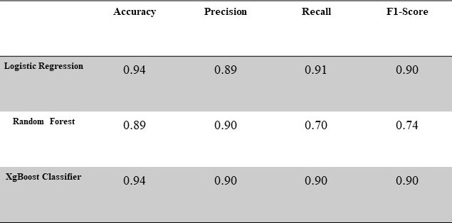

# DS_ML_CombiningText-NumericData

## FrauenLoop Graduation Project: Intermediate Machine Learning Cycle

## How to combine textual and numeric features for Machine Learning in Python

### What is done in this project? What is the contribution of this project? 

The dataset (Women’s Clothing E-Commerce Reviews) is used many by many data scientists to demonstrate how to work with text data in Machine Learning. However, the available data analysis and ML algorithms on the web are constructed to predict the target feature only by using text data. In this project, I employ all the available features, including categorical, numeric, and text data, to predict the target feature. In the end, non-text features increase the prediction accuracy by around 5-7%, depending on the ML algorithm.

### Information about the dataset:
The dataset includes 23486 rows and 10 feature variables. Each row corresponds to a customer review and contains the following features:
Categorical features: Division Name, Department Name, and Class Name
Numeric features: Clothing ID, Age, Rating, Positive Feedback Count
Text features: Title and Review Text
This project aims to predict the labels for the target variable, i.e., whether a product is recommended or not. 
The analysis included EDA and finding the best predictive model for the recommendation.

### Exploratory Data Analysis
Here are some interesting facts about the data:
    • Target Feature: 78% of the customers recommended a product, while 22% of the customers did not recommend the product. 

This can be considered a class imbalance problem. Due to the text data, I cannot employ Synthetic Minority Oversampling Technique (SMOTE). So, I decided to control this issue while running the ML algorithms. In logistic regression, I adjusted the hyperparameter class_weight to ‘balanced,’ while XGBoost can partly handle class imbalance. Alternatively, the scale_post_weight hyperparameter can be set in XGBoost. The class imbalance problem mainly affects Random Forest since the decision trees are sensitive. So, each tree is biased in the same direction and magnitude (on average) by class imbalance. 
    • The relationship between product recommendation and product rating is also noteworthy. 

Customers who gave a rating of 3 to the product had a tendency not to recommend the product though they found the product average. 

### The Challenge of Combining Text and Numeric Data

After splitting the train and test data, the main challenge is to deal with the text data since the train set is already an array. In order to be able to perform Term Frequency – Inverse Document Frequency (tfidf), I convert the train and test arrays into a data frame. Then I take the data with tfidf scores and merge it with the data frame versions of train and test data frames. In the last step, I transform the new data frames into arrays since the ML algorithms work only with the arrays.

Model Evaluation Metrics

The Logistic Regression and XgBoost perform well in terms of the accuracy scores and the ROC curve.

Why did Random Forest perform so terribly? Here are some of the possible explanations:

> During the bootstrapping, some observations might not be included in the samples. 
> the number of columns > the number of observations in the training set - boosting can deal with it but bootstrapping algorithms may perform worse under this condition.

Here is the confusion matrices for three algorithms: 

Confusion Matrices

